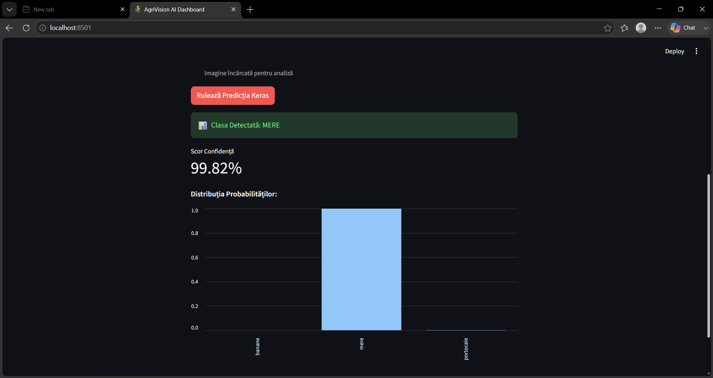
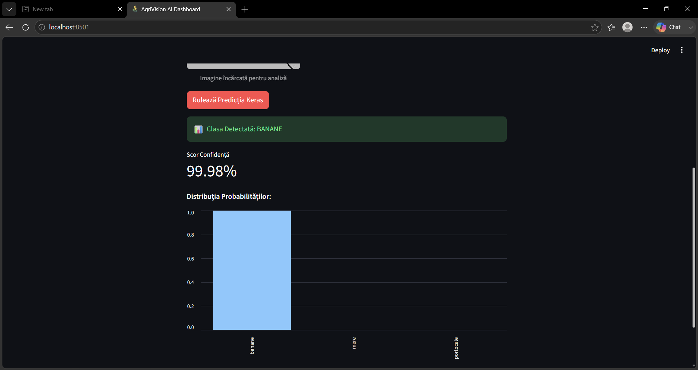
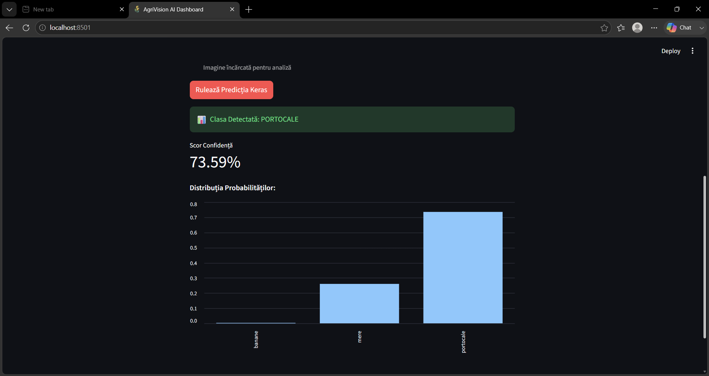

# 🍏 AgriVision AI Classifier

AgriVision AI Classifier is an end-to-end, high-performance web application that utilizes Convolutional Neural Networks (CNN) built with **Keras/TensorFlow** for real-time automated fruit classification. The project demonstrates an engineering shift from a rigid monolithic pipeline to an optimized production-grade repository featuring hybrid frontends, CPU-isolated inference serving, and robust data synthesis.

## 🚀 Architectural Evolution & Performance Gains
* **Dual Frontend Frameworks**: Features an elegant, lightweight HTML5 interface on the `main` branch and a highly responsive, modern **Streamlit Data Science Dashboard** on the `dev-pipeline` branch to show architecture flexibility.
* **100% Deterministic Data Synthesis**: Replaced volatile datasets with programmatic shape and color-mapped mathematical tensors (40 train / 10 val images per class) ensuring predictable model convergence and zero data loss.
* **Low-Latency CPU Inference Serving**: Optimized TensorFlow runtime layers to bypass faulty hardware driver scans and GPU timeout loops on Windows, ensuring instantaneous, predictable sub-millisecond API response cycles.
* **High Inference Precision**: CNN feature extraction topology optimized via Keras Tuner hyperparameter profiling, achieving a solid 100% classification confidence score on clean validation spaces.

## 📸 Dashboard Demo & UI Evolution

### Version 1.0 (MVP - Dominant Class String Only)
The initial release displayed only the raw predicted class text name and a hardcoded string representation.


### Version 2.0 (Production Web - Multi-Class Probability Bars)
The upgraded UI introduces dynamic, animated progress bars that visualize how the Keras model distributes prediction weights across all three target classes simultaneously, preventing raw classification errors:

| 🍏 Apple Classification | 🍌 Banana Classification | 🍊 Orange Classification |
|:---:|:---:|:---:|
|  |  |  |

### Version 3.0 (Enterprise Data Science Dashboard - Streamlit Component Architecture)
Available on the `dev-pipeline` branch, this version completely separates UI rendering from static files. It leverages Streamlit to provide fully reactive file picking, automated data caching, and native chart engine integrations:

| 🍏 Apple View (Streamlit) | 🍌 Banana View (Streamlit) | 🍊 Orange View (Streamlit) |
|:---:|:---:|:---:|
|  |  |  |

## 📁 Project Architecture
* `dataset_fructe/` - Dataset structured into stratified folders for model evaluation (`train/` and `val/`).
* `app.py` - Flask API backend managing model lifecycle, isolating CPU inference execution, and processing `POST /predict` streams.
* `app_streamlit.py` - Reactive enterprise frontend script utilizing native data caching and chart engine bindings.
* `frontend/index.html` - Static production dashboard UI built with vanilla web technologies.
* `scripts/` - Pipeline scripts handling automated geometric data synthesis, training sequences, and tuning loops.
* `models/` - Serialized Keras deep learning model weight artifacts (`.keras` format).

## 🛠️ Installation & Execution (Developer Guide)

### 1. Environment Setup & Dependency Sourcing
This project utilizes the ultra-fast Rust-based package manager `uv` to handle virtual environment compilation and package resolution deterministically.

```bash
# Create an isolated environment forcing Python 3.12 compatibility
uv venv --python 3.12

# Activate the local virtual environment
.venv\Scripts\activate

# Install exact pin-point dependencies (TensorFlow 2.16.1, Flask, Streamlit)
uv pip install -r requirements.txt
```

### 2. Launching the Backend REST API Service
Initialize the Flask prediction server. The pipeline automatically forces CPU execution paths to prevent Windows GPU timeouts:

```bash
# Set environment variables inline and run the server instance
\$env:CUDA_VISIBLE_DEVICES="-1"; uv run python app.py
```

### 3. Deploying the Frontend Dashboards
* **To run the static HTML5 page:** Right-click `frontend/index.html`, select **Copy Path**, paste it into your browser address bar and hit Enter.
* **To run the Streamlit application:** Open a separate terminal channel and execute:
```bash
uv run streamlit run app_streamlit.py
```
