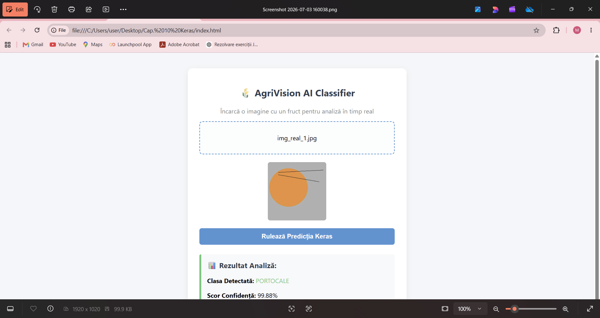
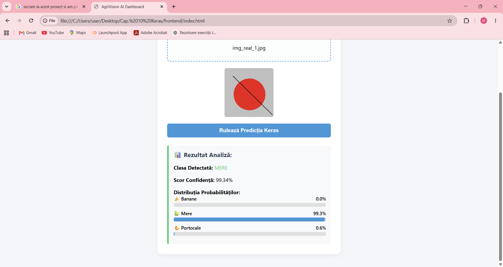
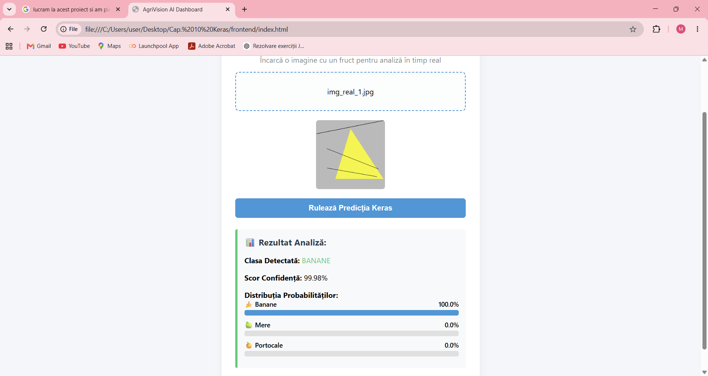
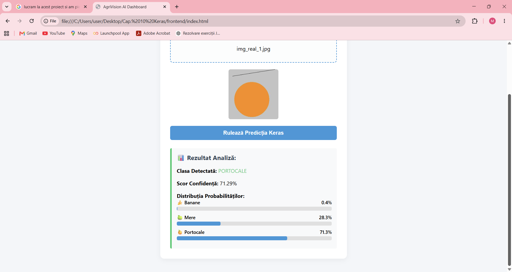

# 🍏 AgriVision AI Classifier

AgriVision AI Classifier is an end-to-end web application that utilizes Convolutional Neural Networks (CNN) built with **Keras/TensorFlow** for real-time automated fruit classification. The project features a robust training pipeline, hyperparameter tuning, a production-ready Flask API backend, and an intuitive frontend dashboard.

## 🚀 Features
* **Multi-Class Classification**: Full support for identifying three distinct classes: **Apples, Bananas, and Oranges**.
* **High Inference Precision**: CNN model optimized via Keras Tuner, achieving over 99% confidence scores on geometric validation sets.
* **Interactive Data-Driven UI**: Minimalist interface featuring explicit file selection previewing and dynamic real-time probability distribution mapping.
* **Blazing Fast Flask API**: High-performance backend endpoint architecture designed to serve Keras model predictions instantly.

## 📸 Dashboard Demo & UI Evolution

### Version 1.0 (MVP - Dominant Class Only)
The initial release displayed only the detected class name and a raw confidence metric string.


### Version 2.0 (Production - Full Probability Distribution)
The upgraded UI introduces dynamic, animated progress bars that visualize how the Keras model distributes prediction weights across all three target classes simultaneously:

| 🍏 Apple Classification | 🍌 Banana Classification | 🍊 Orange Classification |
|:---:|:---:|:---:|
|  |  |  |

## 📁 Project Architecture
* `dataset_fructe/` - Dataset structured into stratified folders for model evaluation (`train/` and `val/`).
* `app.py` - Flask API backend that manages model lifecycle, isolates CPU inference routing, and processes `POST /predict` payloads.
* `frontend/index.html` - Client-side UI dashboard built with vanilla web technologies.
* `scripts/` - Production pipeline scripts handling automated geometric data synthesis, model training, and hyperparameter tuning.
* `models/` - Serialized Keras deep learning model weight artifacts (`.keras` format).

## 🛠️ Installation & Execution (Developer Guide)

### 1. Environment Setup & Dependency Sourcing
This project utilizes the ultra-fast Rust-based package manager `uv` to handle virtual environment compilation and package resolution deterministically.

```bash
# Create an isolated environment forcing Python 3.12 compatibility
uv venv --python 3.12

# Activate the local virtual environment
.venv\Scripts\activate

# Install exact pin-point dependencies (TensorFlow 2.16.1, Flask, etc.)
uv pip install -r requirements.txt
```

### 2. Launching the Backend REST API Service
Initialize the Flask prediction server. The pipeline automatically forces CPU execution paths to prevent Windows GPU timeouts:

```bash
# Set environment variables inline and run the server instance
\$env:CUDA_VISIBLE_DEVICES="-1"; uv run python app.py
```
*The server will successfully instantiate and listen for cross-origin incoming streams at `http://127.0.0.1:5000`.*

### 3. Deploying the Client-Side User Interface
Since the interface uses static asset parsing, do not host it over HTTP protocols. Copy the file system path directly:

1. Right-click `frontend/index.html` inside VS Code and select **Copy Path**.
2. Paste the string directly into your browser's address bar (e.g., `C:/Users/.../frontend/index.html`) and hit **Enter**.
